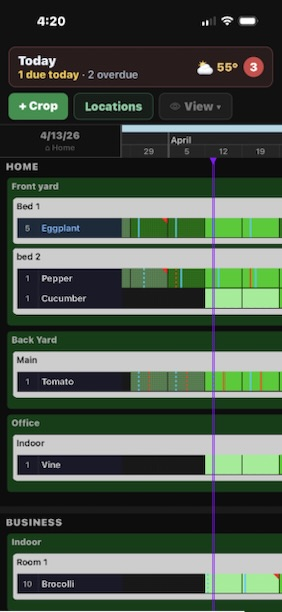
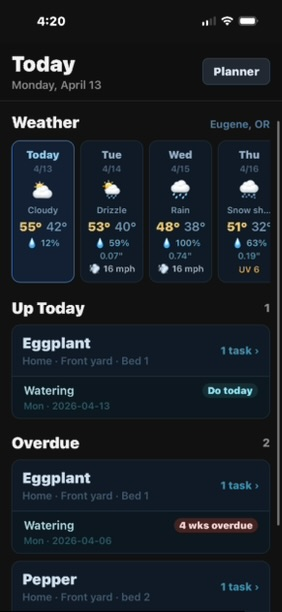

# Crop Planner

A mobile crop-planning app for small-scale growers — built with React Native, Expo, and TypeScript.

## What It Does

Crop Planner replaces a working Excel/VBA crop planner I built from scratch with a mobile-first app that gives growers an at-a-glance view of everything in the ground across a rolling 3-year timeline. It supports both **plant crops** and **mushroom cultivation**, each with their own stage lifecycles and task types.

The core UI is a **scrollable planner grid**: crops run horizontally across weekly columns, color-coded by growth stage. Task lines are drawn as vertical SVG overlays on the grid — solid for pending, dashed for complete. A red cursor marks today. The whole thing is designed to let you manage hundreds of plants (or fruiting blocks) without losing your place.

**Key features:**
- Scrollable timeline grid with frozen row/column headers (156-week span)
- Color-coded crop stages with customizable start dates and durations
- Mushroom support — dedicated stages (Inoculation → Colonization → Pinning → Fruiting → Harvest → Rest → Drying) and task types
- Task tracking with visual line overlays, types, and completion states
- Location hierarchy to organize crops by Location → Garden → Section
- Task Assessment form to quickly view and mark task completions across a season
- Weekly cell notes with image capture/attachment
- Weather dashboard — current conditions, 24-hour hourly forecast, and 10-day forecast (via Open-Meteo)
- SQLite local storage — works fully offline, no account required
- Dark-themed UI optimized for outdoor/greenhouse use

## Screenshots

  
  

<strong>Main planner grid</strong> and <strong>Today dashboard</strong>

<strong>Expanded timeline view</strong>

<strong>Planner navigation</strong>

## Today Dashboard

The Today tab gives a quick operational view for the day:

- **Weather** — tabbed panel showing current conditions (temp, feels-like, humidity, wind, precipitation), an hourly 24-hour forecast, and a 10-day forecast with UV index and min/max temps
- **Up Today** — tasks due today, grouped by crop, with location breadcrumbs
- **Overdue** — tasks from the past 7 days with a "weeks overdue" badge
- Swipe a task row to mark it complete; tap a crop header to jump to its Task Assessment form

## Tech Stack

| Layer | Choice |
|---|---|
| Framework | React Native + Expo (file-based routing) |
| Language | TypeScript |
| State | Zustand |
| Local DB | expo-sqlite |
| Animation | react-native-reanimated |
| Gestures | react-native-gesture-handler |
| Graphics | react-native-svg |
| Date logic | date-fns |
| Weather API | Open-Meteo (no key required) |
| Location | expo-location |
| Images | expo-image-picker + expo-file-system |

## Status

In active development. Core planner grid, crop management (plants and mushrooms), task tracking, assessment form, cell notes, and weather are all functional. Publishing to iOS App Store and Google Play as a free app — premium features planned post-launch based on user feedback.

## Background

This started as a personal Excel tool I used to manage my own growing operation. When it outgrew what a spreadsheet could reasonably do, I decided to rebuild it properly as a native app. It's also my main portfolio project for demonstrating React Native / Expo skills after coming from a background in VBA and Excel automation.
